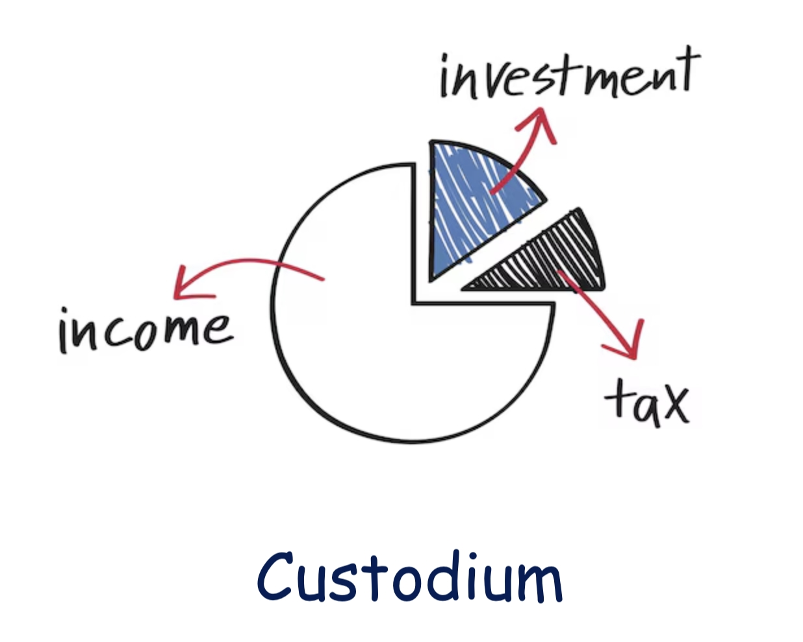

# Custodium

<div align="center">


<br/>
<br/>

[](https://pypi.org/project/custodium/)
[](https://pypi.org/project/custodium/)


</div>


Custodium is a Python package for tracking investment portfolios and calculating adjusted cost basis (ACB) for Canadian capital gain/loss calculations. Primarily designed for educational purposes, so please read the source code and understand the logic before using it for real-world applications and having fun with it!

## Key Features

- Track investment transactions across multiple currencies with automatic exchange rate handling
- Calculate and maintain adjusted cost basis (ACB) over time
- Process special transaction types (e.g., equity vesting)
- Generate capital gains reports for tax purposes

## Installation
```
pip install custodium
```

## Usage

### Processing Transactions

Create a CSV file with these columns:
```csv
date,description,base_currency,quote_currency,quantity,price,fees,note
2023-01-15,Buy AAPL shares,AAPL,USD,10,150.25,9.95,Initial purchase
2023-03-10,Buy MSFT shares,MSFT,USD,15,280.45,9.95,Portfolio diversification
2023-06-30,Sell AAPL shares,AAPL,USD,-5,175.50,9.95,Partial profit taking
2023-08-15,Convert USD to CAD,CAD,USD,1000,0.73,5.00,Currency repatriation
```
Then load and process:

```python
from decimal import Decimal
from custodium.portfolio import Asset, Holdings
from custodium.processing import load_transactions, process_transactions
from custodium.reporting import calculate_yearly_gains, plot_holdings_history
from custodium.utils import displayPandas

# Load transactions from CSV
transactions, df_log = load_transactions("my_transactions.csv")

# Create the portfolio
holdings = Holdings()
reporting_currency = "CAD"

# Create initial holdings with funding
holdings = Holdings()
holdings.add(
    Asset(
        date="2023-01-01",
        asset="CAD",
        quantity=Decimal("10000"),
        acb=Decimal("1"),
    )
)
holdings.add(
    Asset(
        date="2023-01-01",
        asset="USD",
        quantity=Decimal("10000"),
        acb=Decimal("1.35"),  # ACB in CAD per unit of USD
    )
)

# Process transactions
holdings, gains = process_transactions(transactions, holdings=holdings, reporting_currency=reporting_currency)

# View current holdings with readable formatting
displayPandas(holdings.current, precision=2)

# Calculate and display the yearly gains/losses
yearly_gains = calculate_yearly_gains(gains)
displayPandas(yearly_gains, precision=5)

# Plot the history of holdings (Ploty is required)
fig = plot_holdings_history(holdings)
fig.show()
```

## Disclaimer
This package is provided for educational purposes only. Users should not rely on this software for financial advice, tax reporting, or investment decisions without independent verification. The authors accept no responsibility for any financial losses, tax implications, or other issues that may arise from the use of this software.

## LICENSE

This project is licensed under the MIT License. See the [LICENSE](LICENSE) file for details.
